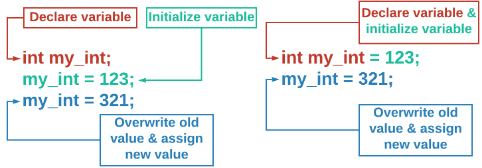

---

---

# Data Types

## Data Types: Floating Point Numbers

### Why Use Double Instead of Float?

In C++, there is a data type called **float**, but as it only uses 4 bytes, it is insufficient for most math. Instead, we use **double** which uses 8 bytes or double the space of a float

> A <kbd>double</kbd> is a floating point number or a rational number meaning it has a decimal or represents a fraction, where an <kbd>int</kbd> (short for integer) is a whole number meaning it does not have a decimal.

## Data Types: Boolean

### Boolean

A boolean variable (declared as a <kbd>bool</kbd>) can only take on the value of <kbd>true</kbd> or <kbd>false</kbd>. You will see how boolean values are used when we talk about conditionals and while loops. 

## Data Types: Strings

### Strings

A string is a collection of text, numbers, or symbols. Strings are always surrounded by quotation marks.

# Declaring Variables

## Declaring a Variable

Declaring a variables has two parts - setting or declaring the **data type** and the **name** of the variable. These two properties of a variable do **not** change.

### Variable Naming Rules

| Rule                                                         | Correct                                                      | Incorrect                                  |
| ------------------------------------------------------------ | ------------------------------------------------------------ | ------------------------------------------ |
| Start with a letter or underscore                            | <kbd>variable</kbd>, <kbd>_variable</kbd>                    | <kbd>1variable</kbd>                       |
| Remainder of variable name is letters, numbers, or underscores | <kbd>var_i_able</kbd>, <kbd>variable</kbd>                   | <kbd>var-i-able</kbd>, <kbd>var!able</kbd> |
| Cannot use a C++ keyword                                     | <kbd>my_class</kbd>                                          | <kbd>class</kbd>                           |
| Variables are case sensitive                                 | <kbd>variable</kbd>, <kbd>Variable</kbd>, and <kbd>VARIABLE</kbd> are all different variables |                                            |

### What Are C++ Key Words?

C++ keys words are words that are reserved for specific functions or tasks within C++ programs. These words **cannot** be used to name variables and will result in errors if they are not handled correctly.

## Initializing, Assigning, and Assessing

### Initializing & Assigning Values

We call the process of setting the **initial** value of a variable **initialization**. Recall that you can do this separately after the declaration or combine it into the same statement as the declaration.

Since the value stored in a variable can change, we call changing the value **assigning** or **re-assigning**. Use the assignment operator, <kbd>=</kbd>, to give a variable a new value.