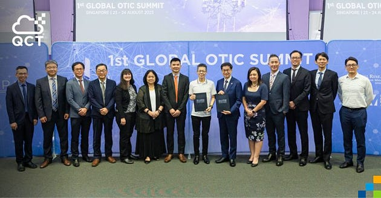
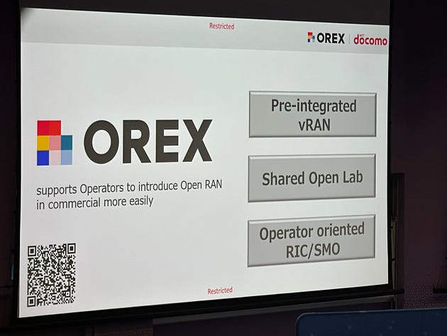
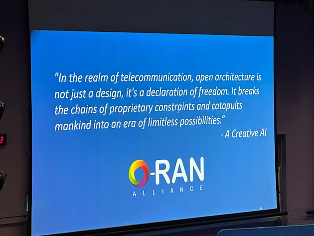
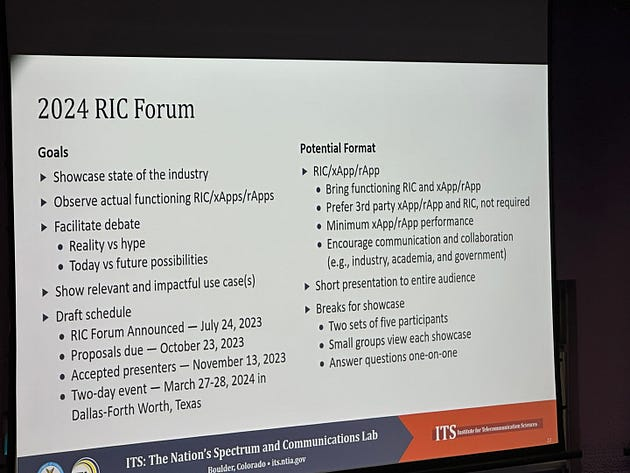

본 글은 Singapore SUTD에서 열린 Global OTIC Summit에 참가하고 난 후기를 기록한 글입니다.

2023년 8월 23–24일에 열리는 OTIC Summit에 다녀왔습니다. 연구실에서 첫 해외출장이고, 유니콘처럼 존재하던 O-RAN 논문 저자들을 직접 볼 수 있다는 점에서 사비를 쓰더라도 꼭 참가하고 싶었던 행사입니다. 위의 사진은 문제가 된다면 바로 삭제하겠습니다.

OTIC는 Open Testing and Integration Centric(OTIC)의 약자입니다. 사실 아직 많은 사람들이 O-RAN에 대해 모르고 있고, 아시는 분들은 O-RAN의 실현성에 대해 의문을 제기하기도 합니다. 사실 O-RAN을 연구하고 있는 저도 이러한 벽을 만날 때마다 O-RAN은 정말 실현될 수 있을까, 단순히 트렌드에 불과하지 않을까라는 불안감을 가지기도 하였습니다.

하지만, OTIC 참가 후 불안감은 연구분야에 대한 자부심으로 바꼈습니다. 국내에서는 O-RAN이라고 말하면 한참을 설명했어야 하는데 해외에서는 5G의 Mega 트렌드이고 많은 분들이 열정적으로 참가하고 계셔서 정말 가슴속에서 무언가가 벅차오르더군요.

특히, O-RAN Alliance의 수장이 한국인 Alex Choi 박사님인 것에 대해 정말 큰 자부심을 느꼈습니다. 사진은 구석에서 발표를 들으며 조심스럽게 찍은 사진입니다. 문제가 된다면 바로 삭제하겠습니다.

또한 NTT Docomo의 Sadayuki Abeta 박사님의 발표도 매우 인상적이었습니다. 사실 이 발표를 들으며 같이 왔던 일행들과 많은 토론을 하였고 심지어 자기 전까지 숙소에서도 많은 토론을 하였습니다.

토론 주제는 ‘OREX가 통신사의 수익에 도움이 될까’, ‘OREX를 통해 O-RAN의 다양성이라는 원칙이 훼손되지 않을까’, ‘우리나라는 일본의 통신사를 따라갈 수 없는것인가’ 등이었습니다. 물론 박사 과정과 석사 과정들의 토론이라 매우 허접할 수도 있습니다만 저희는 당시에 매우 진지하게 토론을 했었습니다.

위의 사진은 발표 시작 , 아이스 브레이킹으로 생성형 AI에게 O-RAN이 무엇인지 물어본 것에 대한 답입니다. 누군가에겐 단순히 아이스 브레이킹일 수도 있겠지만 전 화면을 보며 제가 다시금 O-RAN 연구자라는 것에 대해 자부심을 가지게 되었고, 연구에 대한 두려움을 확신으로 바꾸는 계기가 되었습니다. 이렇게 쓰니까 조금 오글거리긴 하네요 ㅎㅎ

발표 중 RIC Forum에 대한 정보들을 캡쳐하였습니다. 저와 동행하였던 박사 과정 형은 RIC 개발을 연구하고 있는 연구자입니다. 사실 저도 Rimedo Lab의 paper들을 읽어가며 RIC과 서서히 친해지고 있는 중입니다. 이 중 보안에 관해 관심이 많았는데, RIC Forum을 한다니 정말 설레더군요. 기회가 되면 가고 싶지만, 아마 미국에서 열려 힘들 것 같습니다… Youtube에 다시보기가 올라온다면 원격으로나마 참가할 예정입니다.

OTIC 참가를 마치고 나서 저희 연구실과 국제 공동 연구를 하고 있는 BinBin Chen 교수님의 연구실에 랩투어를 갔는데요. **이는 다음 포스팅에 기록하도록 하겠습니다.** 개인적으로 엄청난 기술적 격차를 느낄 수 있었던 기회였습니다. 정말 대단하더군요… 읽어주셔서 감사합니다