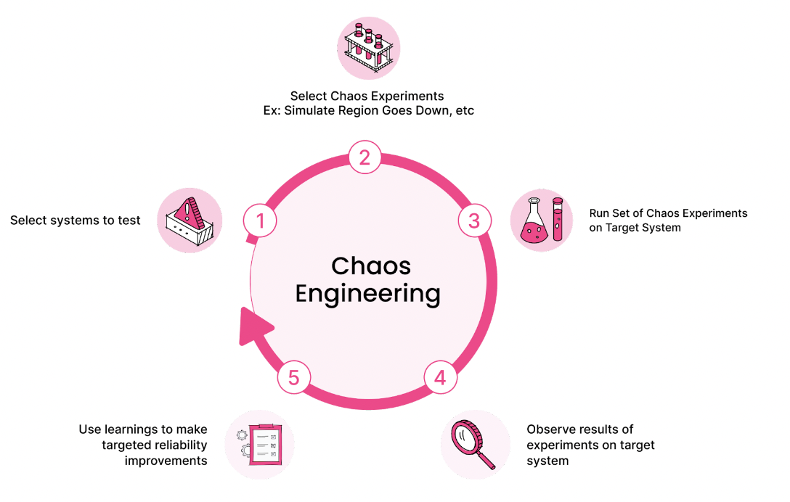

This post summarises the presentation given by Junwoo Jung, a Solutions Architect, at AWS Summit Online Korea 2020.

# Chaos Engineering

The field of experimenting and learning with distributed systems to build stable systems capable of withstanding various failure conditions in production services.

>*Chaos Engineering is the discipline of experimenting on a system in order to build confidence in the system’s capability to withstand turbulent conditions in production.*

Chaos engineering is not about purposelessly destroying a system; it helps proactively discover potential issues through intentionally crafted experiments in a controlled environment.

## Chaos Engineering Prerequisites

### Infrastructure

- Redundancy (multi-AZ)
- Auto Scaling
- Immutable Infrastructure
- Infrastructure as code

### Data / Network

- Read Replica, Write Sharding
- Static & Dynamic Content Caching
- Event Driven Architecture
- Dynamic Routing

### Application

- Exception handling
- Timeouts
- Retries with backoff
- Circuit breakers

### Operation

- Human operators
- Monitoring and observability
- Incident response
- Measure, measure, measure and measure ...

## Steps of Chaos Engineering

### Select systems to test

- System's "steady" state
- Not internal attributes of the system (CPU, memory, etc...)
- Operational metrics linked to customer experience can return to normal

### Select Chaos Experiments

- If...?

  - What if the Load Balancer fails?

  - What if one of the Kubernetes nodes goes down?

  - What if Redis becomes slow?

  - What if latency time increases by 300ms?

  - What if the database suddenly stops?

    

- Refer to historical failures, service dependencies, and gather input from various role holders

### Run Set of Chaos Experiments on Target System

- Start from small

  - Application level (exceptions, errors, etc...)

  - Host level (services, processes, etc...)

  - Resource attacks (CPU, memory, IO, etc...)

  - Network attacks (dependencies, latency, packet loss, etc...)

  - AZ attack

  - Region attack

  - People attack (disrupting work of operators)

    

- If an experiment doesn't maintain steady state, quickly and simply stop the experiment and roll back.

### Observe results of experiments on target system

- Quantify the results of experiments

  - Detection time
  - Alert time
  - Time it took to start step-by-step performance recovery
  - Time it took for self-healing
  - Time it took for partial and full recovery
  - Time it took to stabilize

  

- *Postmortem* for improvement

  - Specific failure scenarios
  - Impact on customers and the business (customers, features, regions)
  - Root cause analysis using The 5 Whys
  - Data required for analysis
    - Metrics and graphs
  - Lessons learned from the failure
  - Necessary actions
    - Action items

### Use learnings to make targeted reliability improvements

- Execute action items derived from experiments

  

>Chaos engineering is a methodology that greatly helps in discovering hidden issues. Ultimately, *people need to provoke the system.*

---

# Fail Injection

### Resource Level

- Exhausting CPU, memory, and I/O : stress-ng

- Exhausting the disk space on hard drives: dd

- Exhausting application APIs: wrk

  

### Network/Dependencies Level

- ***Injecting latency, loss and corrupting the network: tc, /etc/hosts, Blackholling***

  

### Application, Process, Service Level

- Killing Python processes, Java processes

- Database failure injection, Failures in the serverless world

  

### Infrastructure Level

- Randomly stopping an EC2 instance in an availability zone

# Tools for Chaos Engineering

### Chaos Monkey from Netflix

- Simian Army

- Chaos Gorilla, Chaos Kong

- Latency Monkey, Doctor Monkey, Conformity Monkey

- Kube Monkey

### Chaos Toolkit, ChaosIQ

### Litmus

### PowerfulSeal

### Istio

### Gremlin Inc.

### Chaos Mesh

---

Through this post, I was able to learn the basics of chaos engineering. In the next post, I will explore how chaos engineering can be used to improve the performance of 5G core network. Thank you for reading!