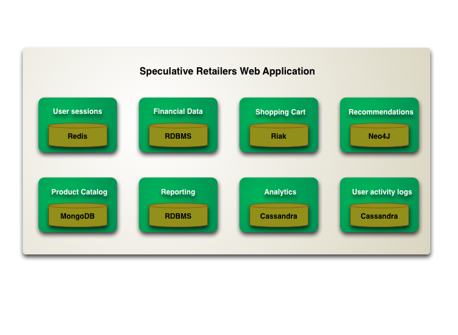

This post is a summary of a Microservice Architecture lecture in english I attended.

# What is Microservice Architecture?

- It involves breaking down an application into a multitude of autonomous services
- Each service runs in its own separate process
- Communication between these small applications occurs through lightweight mechanisms like HTTP APIs
- Each small service is responsible for a specific business function
- Deployment is done independently, following fully automated procedures
- These services can use different programming languages and data storage technologies

# Drawbacks of Monolithic Systems

- Inefficiency when scaling out the entire system
- Long build and deployment times
- Even minor changes require rebuilding and redeploying the entire system
- A single bug can lead to a complete system failure
- High coupling between features, making it challenging to assess the impact of changes
- Overall, it's difficult to deploy code quickly in an operational environment

## How MSA Addresses Monolithic Issues

- Scalability at the service level
- Partial failures do not affect the entire system
- Independent deployment of services
- This results in a more agile response to rapidly changing business environments

## Why Choose MSA? - Technical Perspective

- Cloud computing

- NoSQL databases

- Docker, Kubernetes, and related ecosystems

- Netflix OSS (Open Source Software)

- Accumulating use cases and best practices

  

## Why Choose MSA? - Business Perspective

- Rapid changes in the business environment

- Many cases where businesses depend on IT technology

- Adapting to rapid business changes is challenging without agile IT technology

  

---

# Advantages of Microservice Architecture

## Faster Delivery

- Each service is independently developed and loosely coupled
- Smaller services result in a narrower impact scope for changes
  - Quick impact assessment, speedy builds, and fast testing
- Services are loosely coupled through network interfaces
  - Allows for autonomous deployment between services

## Flexible and Selective Scalability

- Scalability at the service level

- Monolithic systems require scaling out the entire system, which is inefficient

- Smaller codebases in each service make scaling more cost-effective

  

## Support for Polyglot Architecture

- Traditional development environments impose standard technology on organizations
- Microservice architecture allows for the application of the most suitable technology for specific tasks
- Each service can choose its unique programming language and framework

## Experimentation and Innovation

- Recent business scenarios demand technological innovation

- Experimenting with technology is challenging in a Monolithic environment

  - Changing databases or frameworks, let alone upgrading programming languages, can be difficult
  - Issues related to impact and costs

- Microservices make it easier to experiment with new technologies

  - Smaller code bases

  - Loose coupling between services

    

## Replaceability

- It's possible to entirely redevelop using a new language or framework

  - Alternatively, you can replace it with open-source or commercial solutions

- Because each service is small and loosely connected to others

- The appropriate service size varies:

  - It might take two weeks for a complete redevelopment

  - There's no one-size-fits-all answer

    

## Managing Technical Debt

- If you don't maintain software as it ages, technical debt accumulates

- Monolithic systems are challenging to modify due to strong coupling

  - For example, one company stated that if they refactor code today, it causes a company-wide outage

- Smaller service sizes make quality management easier

- When making code improvements for quality enhancement, the impact is minimal

  - Continuous improvement work is possible and can become part of the organization's culture

    

# Disadvantages of Microservice Architecture

- Inefficient Use of Computing Resources Compared to Monolithic

- Performance - Slower Than Internal Calls

- Memory - Repetitive Resource Usage, Such as JVM

- Difficult Operational Management

- Increased Monitoring Targets

- More Services to Deploy and Diverse Technologies

- Various Failure Scenarios

- Increased Difficulty in Unit Testing and Component Testing

- Complex DB Transaction Handling

- Polyglot Data Store Usage Among Services

- Challenges with Transactions in a Distributed Environment

