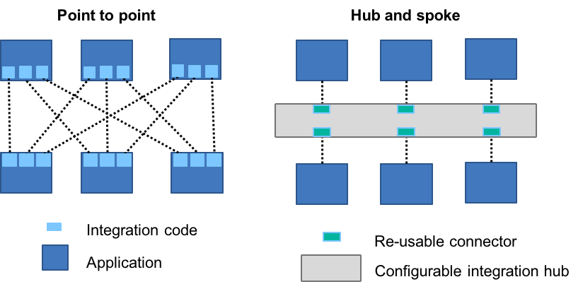

This post is a summary of a Microservice Architecture lecture in english I attended.

# Microservice Architecture Features

## Componentization Through Services

- Defining and connecting components has been a long-standing challenge in the software industry
- In Microservice Architecture (MSA), services are defined as components
  - They handle specific business functions
  - Run independently as separate processes
  - Can be deployed autonomously
- Services should be designed with high cohesion
- Clear interfaces are provided between services for collaboration

## Organizational Structure Based on Business Competencies

- Conway's Law
  - The organization that designs a system will produce an architecture that resembles the organization's communication structure
- The organization's structure influences the system's architecture
- Teams within MSA possess the capability to create services
- There's no fixed team size
- Loosely coupled teams lead to a loosely coupled overall system
  - According to Conway's Law
- In the past, development and operations were separate
  - After project development, software was transferred to the operations team
- In MSA, teams are responsible for the entire lifecycle, including development and operations

## Focus on Products Rather Than Projects

- A shift in perspective for team members when looking at the software they create
  - Increasing points of contact with customers and gathering feedback
- Not just developing a collection of features and handing them over
- Teams contemplate how the software can deliver value to customers
- Recognizing the relationship between software and the company's business

## Intelligent End Points, Simple Pipes

- Domain logic is maintained with high cohesion within each service
- Connections between services are established using HTTP APIs, message queues, etc
  - No Enterprise Service Bus (ESB)

## Distributed Governance

- No enforcement of strong central standards or procedures

- Teams find and apply efficient methodologies, tools, and technologies

  - Applying the most suitable technology to each service

- Similar to a federal system

  

## Distributed Data Management

- Monolithic systems typically use a single integrated database
- Ease of transaction handling
- Different functions may access tables directly
- In MSA, each service manages its own data
- Services can use different data storage technologies
  - Polyglot Persistence
- Access to other services' data is only possible through APIs
- Transaction handling is challenging, resulting in eventual consistency

## Infrastructure Automation

- Automated Testing
- Automated Continuous Integration
- Automated Continuous Deployment

## Resilience by Design

- Failures in specific services always occur and propagate to other services
- Preventing the propagation of some service failures to the entire system is crucial
- Rapid detection of abnormal behavior within services is essential
- Designing for possible automatic recovery is necessary
- Understanding the impact of failures on customers is also important
- Netflix's failure-inducing tests
  - Chaos Monkey
  - Chaos Gorilla
  - Chaos Kong
- Circuit Breaker pattern
  - Prevents failures in some services from spreading to the entire system

